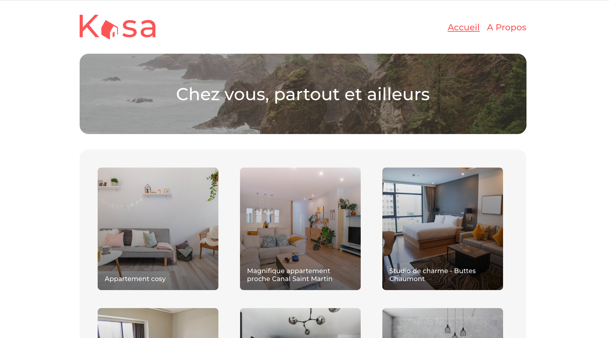

# Kasa, OC project # 11

This is my first project in React. I only have to use Class Components (not Hooks) for this case study.

-   [See my Website](https://vibrant-booth-2e848b.netlify.app/) 👋

<kbd></kbd>

## Instructions

The Kasa website, a platform for renting accommodation between individuals (more than 500 ads posted per day), was coded more than 10 years ago in in ASP.NET with a significant legacy code.

We needed to completely overhaul the site to a full JavaScript stack with NodeJS on the back-end, and React on the front-end.
I'm in charge of creating the front-end in React from the provided mockups.

### Resources provided

-   [Coding Guidelines](https://course.oc-static.com/projects/Front-End+V2/P9+React+1/Coding+guidelines+Kasa+FR.pdf)
-   [UI mockup](https://www.figma.com/file/bAnXDNqRKCRRP8mY2gcb5p/UI-Design-Kasa-FR?node-id=0%3A1)
-   [Data Json](https://s3-eu-west-1.amazonaws.com/course.oc-static.com/projects/Front-End+V2/P9+React+1/logements.json)

## Available Scripts

In the project directory, you can run:

### `yarn start`

Runs the app in the development mode.\
Open [http://localhost:3000](http://localhost:3000) to view it in the browser.

The page will reload if you make edits.\
You will also see any lint errors in the console.

## Learn More

You can learn more in the [Create React App documentation](https://facebook.github.io/create-react-app/docs/getting-started).

To learn React, check out the [React documentation](https://reactjs.org/).
